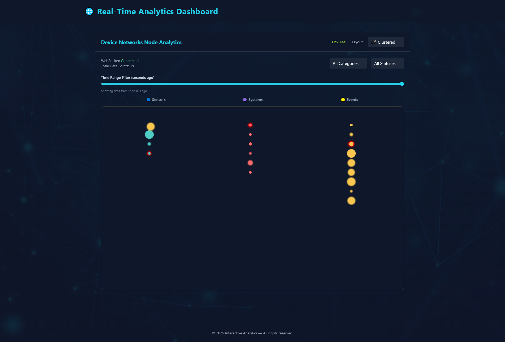

# 📡 Data-Driven Visualization Dashboard

An interactive real-time analytics dashboard built with **PixiJS**, **React**, and **WebSockets**, optimized for rendering and animating thousands of data points efficiently — with dynamic filters, advanced effects, and a sleek dashboard UI.

> Created by [Esraa Albhairy](https://github.com/EsraaSaad298)  
> 🌐 **Live Demo:** _Coming soon on Netlify_

---

## 🚀 Overview

This project showcases a highly-performant, interactive data visualization tool that simulates **live device/network telemetry** using a WebSocket feed. Nodes are animated on a dynamic 2D canvas using PixiJS with interactive filters, transitions, and real-time performance tracking.

---

## 🔧 Setup & Installation

```bash
# Clone the repository
git clone https://github.com/EsraaSaad298/data-visualization-dashboard.git
cd data-visualization-dashboard

# Install dependencies
npm install

# Start the development server
npm run dev
```

> Built with **Vite + React + TypeScript + TailwindCSS**

---

## ✨ Features

- 📡 **Live WebSocket Data:** Real-time updates using a live echo server (`wss://ws.postman-echo.com/raw`)
- 🎨 **PixiJS Rendering:** Smooth, performant 2D canvas rendering with shaders and filters
- 🔁 **Animated Transitions:** Layout switches (Clustered ↔ Freeform) use smooth GSAP animations
- 🔍 **Advanced Interaction:** Zoom, pan, hover tooltips, and node click popups
- 🧠 **Smart Sprite Management:** Only changed nodes update for optimal performance
- 🎯 **Filters & Sliders:** Realtime filtering by category, status, and time interval
- 🔊 **Audio Feedback:** Subtle audio cue when a node is deleted (confirmed only)
- 🌐 **Fully Responsive:** Layout adapts across devices with sticky headers and pixel-perfect visuals
- 🧩 **Category-Aligned Clustering:** Nodes appear directly under labeled categories
- 🎛️ **Custom Background & UI Polish:** Overlayed background image, animated shaders, and visual depth

---

## 🧠 Advanced Techniques Used

### 🎨 PixiJS + Shaders

- Used `PIXI.Graphics`, `generateTexture`, and `Sprite` for performant, dynamic node rendering
- Applied `@pixi/filter-glow`, `@pixi/filter-blur`, and `DisplacementFilter` for visual FX
- Background ripple shader simulates movement beneath the canvas

### 🔁 Smart Node Diffing

- Nodes stored in a `Map<string, Sprite>` and updated only when data changes
- Uses `useEffect` to control lifecycle and Pixi `Ticker` for frame management

### 🧭 Interactivity & UX

- Smooth pan & zoom behavior via Pixi events
- DOM tooltips follow pointer, not locked to canvas
- Custom audio integration using HTML5 `Audio` on delete confirmation

### 🛠️ State & Performance

- Category, status, and time range filters handled in React state
- Layout modes passed as props to `VisualizationManager`
- 60 FPS minimum performance target maintained, even with hundreds of nodes

---

## 🖼️ Screenshot



---

## 🌐 Deployment (Netlify)

1. Build your project:

```bash
npm run build
```

2. Deploy via:

- ✅ Drag `/dist` folder to [Netlify Drop](https://app.netlify.com/drop)
- ✅ Or connect repo to Netlify and auto-deploy from `main` branch

---

## 🏆 Bonus Features

- ✅ Delete sound (only on confirmed action)
- ✅ Custom dropdown icons (🎯 layout modes, 🔴 statuses)
- ✅ FPS counter in top-right corner
- ✅ Displacement ripple shader background
- ✅ Layout transitions between clustered & freeform
- ✅ Background image with dark overlay for pixel-perfect contrast
- ✅ Tooltip & sprite optimization for smooth interaction

---

## 🧑‍💻 Author

**Esraa Albhairy**  
[GitHub → @EsraaSaad298](https://github.com/EsraaSaad298)

---

## 📄 License

This project is open-source and available for review during hiring assessments or collaboration.

---
